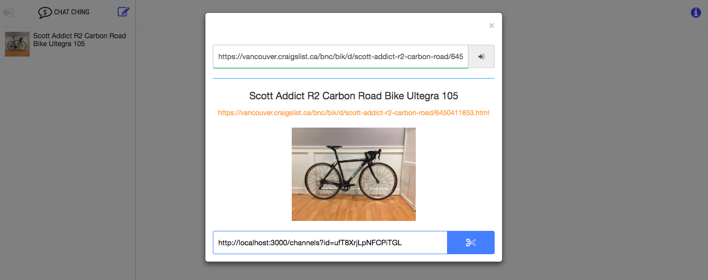
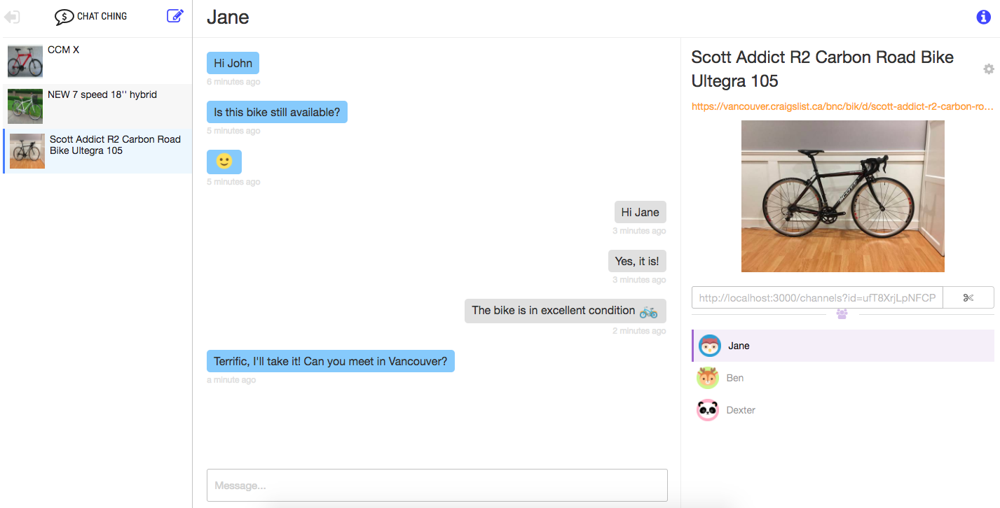
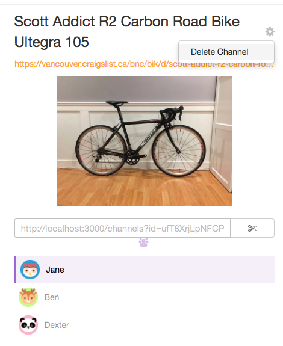

# Chat Ching

Private messenger for Craigslist. Built using Meteor.

## How does it work?

#### 1. Create an account


#### 2. Add your Craigslist listing 


#### 3. Auto Copy the generated link 

You can now include this link on your Craigslist posting to start your own personal messenger for your potential buyers. 



#### 4. Start Chat-Ching'ing!




#### 5. Once you're done, you can delete the channel.



## How to Deploy on your own local machine

```ruby
$ git clone https://github.com/samanthaming/chat-ching.git
$ cd chat-ching
$ meteor
```

## Features

- Animation using [Animate.css](https://daneden.github.io/animate.css/) :rainbow:
- Design using [Materialize](http://materializecss.com/) :candy:
- Data Scraping using [Meteor-scrape](https://github.com/Anonyfox/meteor-scrape) :mag:
- Emoji support using [EmojiOne](https://www.emojione.com/) :simple_smile:
